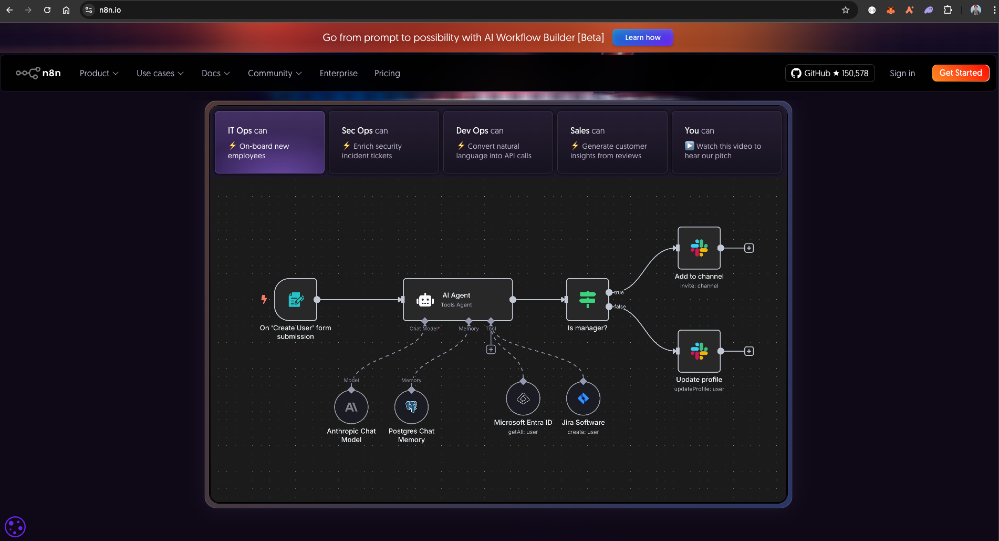
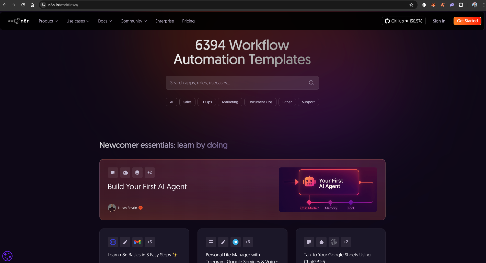
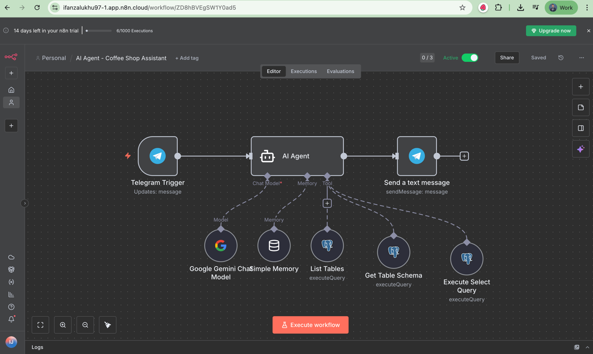
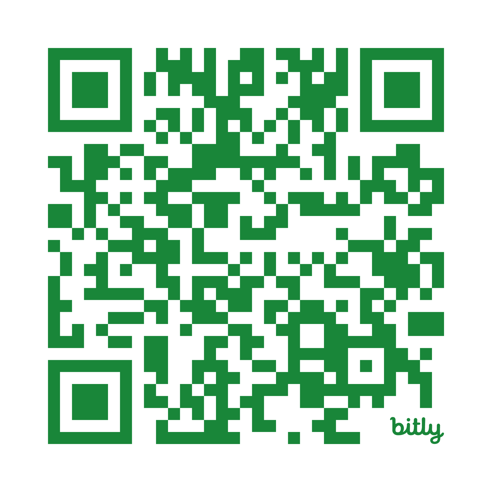

# **Generative Artificial Intelligence (AI): Workflow Automation dengan n8n dan Gemini AI**

Repository ini merupakan **materi dan exercise workshop** bertema
**"Generative Artificial Intelligence (AI): Workflow Automation dengan n8n dan Gemini AI"**
yang diselenggarakan oleh **Program Studi D-III Teknik Informatika, Fakultas Vokasi, Universitas Sumatera Utara**,
dan dibawakan oleh **Ifan Jaya Suswanto Zalukhu**, **Head of Engineering** di **SimpliDOTS**.

Repository ini juga berfungsi sebagai **referensi pembelajaran** dan **bahan eksplorasi** untuk memahami penerapan **Generative AI** dalam **workflow automation** menggunakan **Gemini AI** dan **n8n**.

## Apa itu Generative AI?

**AI generatif** adalah jenis **kecerdasan buatan** yang dapat **menciptakan konten baru**, seperti teks, gambar, video, atau musik. Cara kerjanya mirip dengan seniman yang belajar dari berbagai karya: AI ini dilatih menggunakan **kumpulan data yang sangat besar** dan mempelajari pola serta struktur di dalamnya. Setelah dilatih, ia dapat menggunakan pengetahuan tersebut untuk **menghasilkan sesuatu yang benar-benar baru dan orisinal**, mirip dengan gaya atau karakteristik dari data yang sudah dipelajarinya.

Berbeda dengan **AI tradisional** yang hanya bisa melakukan tugas spesifik yang sudah diprogram, **AI generatif** mampu **menghasilkan konten tanpa perlu diberi tahu secara detail** langkah-langkah pembuatannya. Anda cukup memberikan **perintah sederhana (prompts)**, dan AI akan menghasilkan respons yang kreatif. 

Contohnya termasuk:
- **Chatbot** seperti **[ChatGPT](https://chatgpt.com/)**, **[Gemini](https://gemini.google.com/)** untuk menghasilkan teks
- Program seperti **[Midjourney](https://www.midjourney.com/explore)** dan **Stable Diffusion** yang bisa menciptakan gambar realistis berdasarkan deskripsi Anda

## Apa itu Workflow dan n8n?

**Workflow** bisa diibaratkan seperti **alur kerja otomatis** yang menghubungkan beberapa langkah atau aplikasi untuk menyelesaikan tugas tanpa harus dilakukan manual satu per satu. Misalnya, ketika seseorang ingin melihat **total penjualan** atau **report pemesanan kopi**, sistem bisa otomatis mengambil data dari database, menghitung hasilnya, dan menampilkannya tanpa perlu menulis query SQL secara langsung — semua berjalan karena sudah diatur dalam satu **workflow**.

Nah, **[n8n](https://n8n.io/)** adalah salah satu platform **low-code / node-based workflow automation** yang memudahkan kita membangun alur kerja seperti itu. Dalam konteks **Generative AI**, n8n bisa digunakan untuk membuat **AI Agent** yang mampu menjawab pertanyaan seputar penjualan di sebuah Cafe atau Coffee Shop, misalnya *"Produk apa yang paling sering dibeli hari ini?"* atau *"Berapa total pendapatan minggu ini?"*. Semua proses tersebut bisa berjalan otomatis karena **n8n bertindak sebagai orchestrator**, sementara **AI menjadi brain-nya**.

Selain untuk **AI Agent**, n8n juga punya banyak fungsi lain. Ia bisa digunakan untuk menghubungkan berbagai layanan seperti **email**, **database**, **API**, hingga **sistem CRM** tanpa perlu menulis banyak kode. Di luar sana ada juga tools serupa seperti **[ActivePieces](https://www.activepieces.com/)**, **[Dify](https://dify.ai/)**, atau **[OpenAI AgentKit](https://openai.com/index/introducing-agentkit/)**, tapi kita menggunakan **n8n** karena **komunitasnya luas**, **dokumentasinya lengkap**, dan **sudah banyak diadopsi secara global** — cocok banget buat belajar **workflow automation modern**.

Termasuk juga kalau teman-teman ingin **ikut gabung dan diskusi langsung** dengan **komunitas n8n Indonesia** di Discord, bisa mampir ke sini 👉 **https://n8n.io/**

Selain itu, karena **komunitasnya sudah besar**, n8n juga punya banyak **template siap pakai** yang dibuat oleh para pengguna di seluruh dunia — jadi kita bisa **belajar dan mulai dengan lebih cepat**. Beberapa template ini bisa langsung diakses dari situs resminya di sini: **https://n8n.io/workflows/**

## Apa yang Akan Kita Buat di Workshop Ini?

Di workshop ini, kita akan **berkenalan langsung dengan n8n** dan membangun sebuah **AI Agent workflow** yang seru banget buat dicoba. Nantinya, **AI Agent** ini akan berfungsi sebagai **chatbot yang terhubung ke Telegram**, jadi kita bisa ngobrol langsung dengannya lewat chat — layaknya **asisten pribadi untuk kafe kita** ☕️

**Chatbot** ini akan bertindak sebagai **asisten Coffee Shop**, yang bisa membantu menjawab berbagai pertanyaan seputar **penjualan kopi**. Data yang digunakannya diambil dari **database PostgreSQL** yang dikelola lewat **[Supabase](https://supabase.com/)**, sedangkan kemampuan berpikir dan menjawabnya akan ditenagai oleh **[model Gemini dari Google](https://aistudio.google.com/)**. Jadi, sistemnya bisa menjawab hal-hal seperti *"Berapa total penjualan hari ini?"* atau *"Menu kopi apa yang paling laku bulan ini?"* secara **otomatis dan kontekstual**.

Untuk kebutuhan datanya, kita akan menggunakan **[dataset dari Kaggle](https://www.kaggle.com/datasets/jawad3664/coffee-shop?select=coffe.csv)** sebagai sumber informasi penjualan kopi. Seluruh proses ini akan kita kerjakan secara **bertahap dalam beberapa exercise**, mulai dari **setup environment**, **pembuatan workflow**, **koneksi database**, hingga **integrasi AI Agent ke Telegram**. Jadi, step by step kita bakal membangun **AI Assistant** yang beneran **hands-on dan siap dipakai**.

Selain membangun workflow-nya, kita juga akan belajar sekilas **konsep penting** di baliknya, seperti apa itu **AI Agent**, bagaimana **Agent Tool** bekerja, serta pengenalan singkat tentang **RAG (Retrieval-Augmented Generation)** dan **Prompting**. Dengan begitu, teman-teman nggak cuma bisa bikin proyeknya aja, tapi juga ngerti **"kenapa dan gimana"** AI-nya bisa **berpikir dan menjawab dengan cerdas**.

## Exercises
Nanti disini kita akan bagi menjadi 5 exercise yg saling belanjut
1. [Exercise 1 - Getting Started dengan n8n](exercises/exercise-1.md)
2. [Exercise 2 - Your First n8n Workflow](exercises/exercise-2.md)
3. [Exercise 3 - Membuat AI Agent yang Lebih Interaktif dengan Gemini](exercises/exercise-3.md)
4. [Exercise 4 - Kenalan dengan AI Agent Tool](exercises/exercise-4.md)
5. [Exercise 5 - Integrasi ke Telegram](exercises/exercise-5.md)

## QR Code Materi
Materinya bisa di menggunakan QR ini 

## Demo Bot

