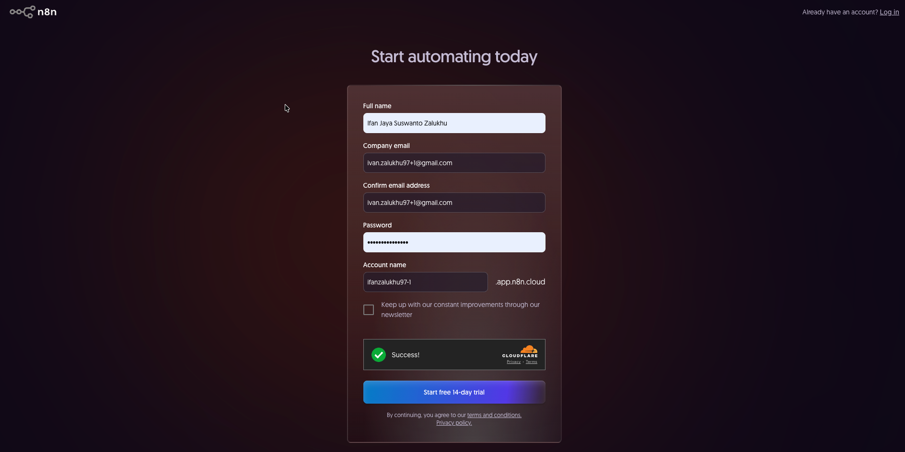
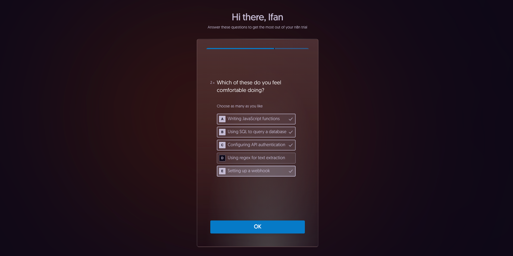
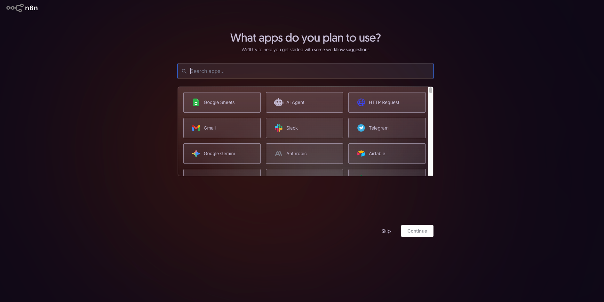
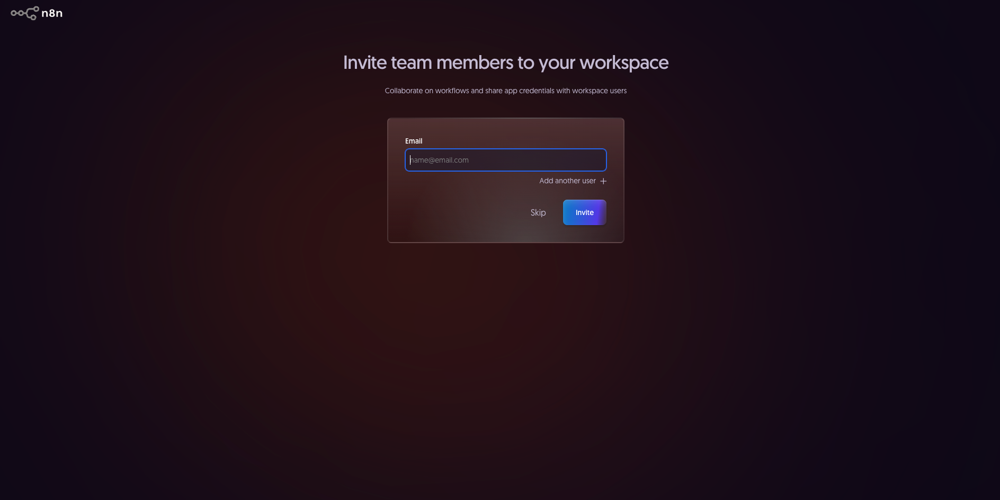
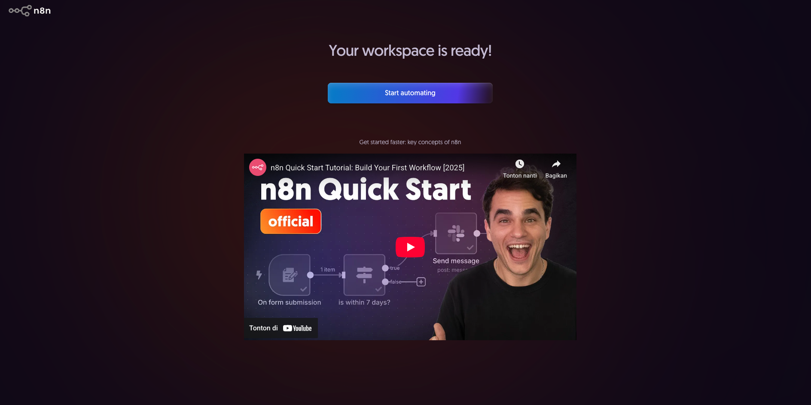
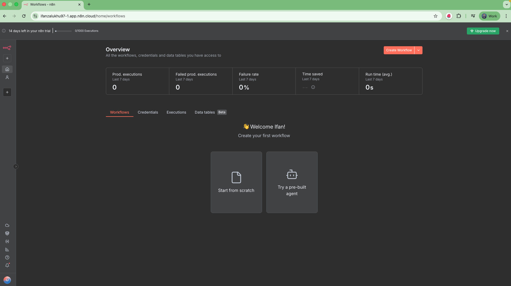
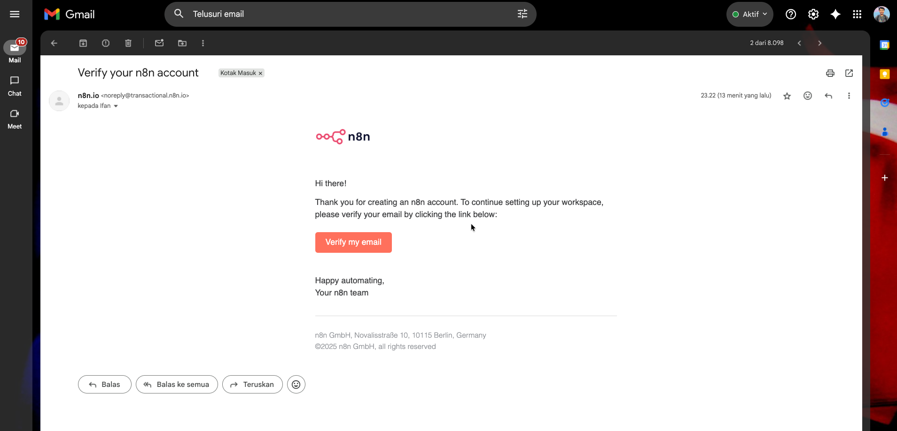
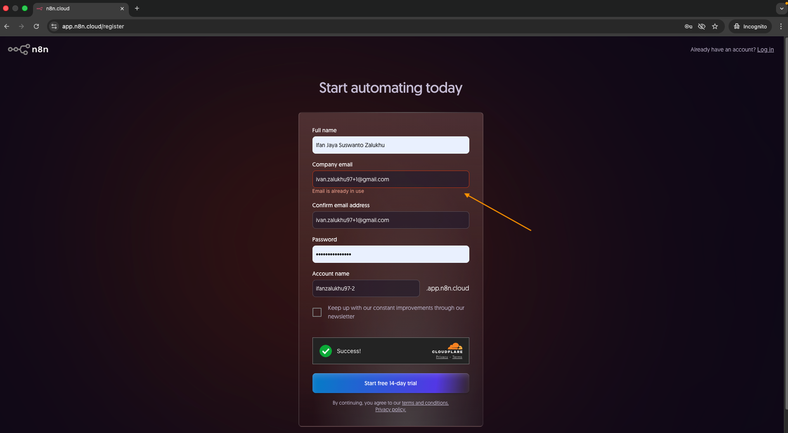

# 🚀 Getting Started dengan n8n

Sebelum mulai bikin AI Agent workflow, kita perlu menyiapkan n8n terlebih dahulu. Ada beberapa cara untuk menjalankan n8n, tergantung kamu mau yang paling cepat atau yang bisa dikustomisasi lebih dalam.

## 🧩 Cara Menjalankan n8n

### n8n Cloud
Cara paling mudah — kamu nggak perlu install apa pun. Cukup daftar di n8n Cloud dan langsung bisa mulai bikin workflow lewat browser.

Cocok banget buat yang mau langsung coba atau untuk demo cepat.

### Self-hosted
Kalau kamu mau lebih bebas dan fleksibel (misalnya untuk integrasi tertentu atau kebutuhan production), kamu bisa menjalankan n8n sendiri di server atau lokal. Ada beberapa cara:

- **[npm](https://docs.n8n.io/hosting/installation/npm/)**: jalankan lewat Node.js, cocok buat developer yang mau install manual.
- **[Docker](https://docs.n8n.io/hosting/installation/docker/)**: opsi paling populer dan praktis — cukup docker run dan n8n langsung jalan.
- **[Server setup guides](https://docs.n8n.io/hosting/installation/server-setups/)**: n8n juga punya panduan lengkap untuk berbagai platform seperti AWS, DigitalOcean, dan lainnya.

## 📜 Lisensi

n8n menggunakan lisensi bernama Sustainable Use License (SUL) — lisensi berbasis konsep fair-code, yaitu model di mana kode sumbernya tersedia dan bebas digunakan, tapi ada batasan untuk penggunaan komersial.

Tujuan lisensi ini adalah agar siapa pun bisa menggunakan dan memodifikasi n8n secara bebas untuk pembelajaran, riset, atau kebutuhan internal, tanpa merugikan pengembang utamanya.

Secara sederhana:
- ✅ Boleh digunakan gratis untuk keperluan pribadi, komunitas, riset, atau internal perusahaan.
- 🚫 Tidak boleh digunakan secara komersial, seperti menjual layanan berbasis n8n atau meng-hosting-nya untuk disewakan ke pihak lain.

Kalau mau baca penjelasan lengkapnya, bisa cek langsung di dokumentasi resmi:
👉 [Sustainable Use License – n8n Docs](https://docs.n8n.io/sustainable-use-license/)

## 💸 Versi Gratis dan Berbayar

n8n juga menyediakan beberapa opsi sesuai kebutuhan kamu:

### Gratis
- 🧠 **Cloud Trial**: versi uji coba gratis dari n8n Cloud.
- 💻 **Community Edition**: versi gratis untuk self-hosted, cocok buat belajar dan eksperimen.

### Berbayar
- ☁️ **n8n Cloud**: punya beberapa paket dengan fitur tambahan seperti eksekusi lebih cepat, dukungan prioritas, dan integrasi yang lebih luas.
- 🏢 **Self-hosted Enterprise**: cocok buat organisasi yang butuh dukungan resmi dan fitur enterprise.

Kamu bisa lihat detail harga dan fitur lengkapnya di halaman [Pricing n8n](https://n8n.io/pricing/).

## 💡 Catatan untuk Workshop ini
Untuk mempermudah proses selama workshop, kita akan menggunakan n8n versi Cloud Trial agar tidak perlu repot melakukan setup manual dan tidak membebani perangkat peserta.

Dengan begitu, semua orang bisa langsung fokus ke bagian yang seru — yaitu membangun AI Agent Workflow dengan n8n dan Gemini!

## ☕ Ok, sekarang mari kita mulai setup n8n kamu:

1. Pertama, daftar akun n8n di sini 👉 https://app.n8n.cloud/
2. Isi form pendaftaran dengan nama, email, password, dan account name.

3. Klik tombol **Start Free 14-day Trial** untuk melanjutkan proses register.
4. Setelah klik tombol trial, nanti akan muncul beberapa pertanyaan (survey).

5. Di bagian "What is the size of your company?", pilih **"I am not use n8n for work."**
6. Di bagian "Which of these do you feel comfortable doing?", pilih bebas aja lalu klik **OK**.
7. Di bagian "How did you hear about n8n?", pilih sesuai preferensi — misalnya **Google** atau **Event**, lalu klik **Submit**.
8. Di bagian "What apps do you plan to use?", pilih **Skip** (nanti kita setup manual).

9. Di bagian "Invite team members to your workspace", pilih **Skip**, karena saat ini hanya kita sendiri yang akan pakai.

10. Saat muncul halaman "Your workspace is ready!", klik tombol **Start Automating**.

🎉 **Selamat! Akun n8n Cloud Trial kamu sudah berhasil dibuat dan siap digunakan.**

**Wait, sebelum mulai bikin workflow pertama…**

Cek dulu inbox email kamu!

Harusnya ada email dengan subject **"Verify your n8n account"**.

Klik tombol **"Verify my email"** di dalam email tersebut untuk mengaktifkan akun kamu sepenuhnya.

Kalau sudah diverifikasi, baru deh kita lanjut ke tahap berikutnya — membuat workflow pertama kita di n8n!

## 💡 Catatan Tambahan: Tips Gmail Normalization

Kalau kamu nemu error waktu register karena email sudah pernah dipakai — tenang aja.

Kamu bisa:
- Coba pakai email lain, atau
- Gunakan Gmail address normalization.

Gmail punya trik unik:
- Dia mengabaikan titik (.) di alamat email
- Dan mendukung alias dengan tanda plus (+) sebelum @gmail.com.

Artinya, semua email berikut akan masuk ke inbox yang sama persis:
- ivan.zalukhu97@gmail.com
- Ivanzalukhu97@gmail.com
- ivan.zalukhu97+1@gmail.com
