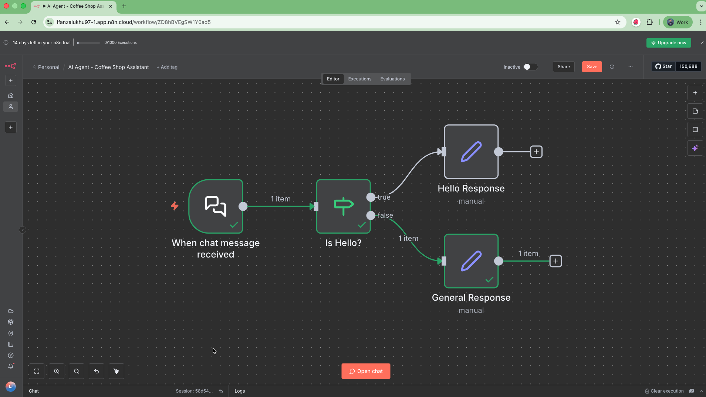

# Your First n8n Workflow

Di bagian ini, kita bakal mulai bikin workflow pertama kita di n8n.

Tujuannya biar kamu bisa paham dasar-dasar cara kerja n8n — mulai dari bikin workflow dari nol sampai ngerti konsep trigger, data processing, dan logic-nya.

## Apa yang Akan Di Pelajari

Di exercise ini, kita akan:

- Membuat workflow baru dari awal
- Mengenal konsep penting seperti:
  - Trigger node (pemicu awal workflow)
  - Cara memproses data antar node
  - Bagaimana logic direpresentasikan di dalam workflow
  - Penggunaan expression di n8n untuk bikin workflow lebih dinamis

## Step 1: Buat Workflow Baru

Begitu kamu login ke n8n Cloud, kamu akan melihat salah satu dari dua tampilan:

1. Halaman welcome screen, dengan dua tombol besar — pilih **Create Workflow** untuk mulai bikin workflow dari awal.
2. Atau kalau kamu sudah pernah buat workflow sebelumnya, kamu akan dibawa ke halaman Workflows list. Klik **Create Workflow** di kanan atas.
3. Ubah nama Workflow bisa diisi bebas atau bisa juga dengan 
    ```
   AI Agent - Coffee Shop Assistant
   ```


💡 **Tips:**
Biasakan kasih nama workflow yang jelas, misalnya "AI Agent - Coffee Shop Assistant", biar gampang dicari nanti.
## Step 2: Tambahkan Trigger Node

Setiap workflow di n8n butuh pemicu awal — alias node pertama yang "menjalankan" workflow-nya.

Ada dua cara untuk memulai workflow:

1. **Manual:**
Contoh tombol Execute Workflow / manual trigger.

2. **Otomatis (recommended):**
Trigger node ini bisa menjalankan workflow berdasarkan event tertentu (misalnya pesan masuk, waktu tertentu, atau data baru dari API).

Nah, karena kita nanti mau bikin chatbot AI yang bisa ngobrol dan ngambil data penjualan dari database, kita akan mulai pakai **Chat Trigger** node.

**Langkah-langkahnya:**

1. Pilih **Add first step** di area canvas.
2. Ketik **Chat Trigger** di kolom pencarian. n8n akan menampilkan daftar node yang sesuai dengan pencarianmu.
3. Pilih **Chat Trigger** untuk menambahkannya ke canvas.

## Step 3: Tambahkan Logika dengan If Node

Kadang workflow kita perlu ngambil keputusan, misalnya "kalau pesan mengandung kata tertentu, lanjut ke A — kalau nggak, lanjut ke B."

Nah, buat hal kayak gini kita bisa pakai **If Node** di n8n.

Node ini memungkinkan kita bikin branching logic (alur bercabang) di dalam workflow, tergantung kondisi tertentu.

Kalau kamu familiar dengan if statement di coding — fungsinya mirip banget.

**Langkah-langkahnya:**

- Klik **Add node** setelah Chat Trigger node.
- Cari **If**, lalu pilih **If node** dari daftar hasil pencarian.
- Setelah node ditambahkan, n8n akan otomatis membuka pengaturannya.
- Di sini, kita akan mengecek apakah pesan dari chat mengandung kata "hello" atau tidak.

**Kalau iya** → lanjutkan ke jalur true (misalnya balas sapaan dengan nama).
**Kalau tidak** → jalur B (general respond).

Setelah logika if selesai dibuat, kita butuh node untuk mengirimkan respons kembali ke user.
Di sini kita akan menggunakan Edit Fields Node, karena node ini memungkinkan kita untuk mengatur atau mengubah nilai output yang akan dikirim oleh chatbot kita.

Nanti hasil akhirnya kurang lebih seperti ini :

# Sekilas Tentang Node di n8n

Node di n8n adalah blok bangunan utama dalam membuat workflow otomatis.

Semua node ini saling terhubung lewat connections, membentuk alur otomatis yang bisa dijalankan tanpa harus coding manual.

- **Koneksi:** Node dihubungkan satu sama lain pakai garis atau connections untuk membentuk workflow.
- **Input & Output:** Node menerima data dari node sebelumnya, memprosesnya, lalu kirim hasilnya ke node berikutnya.

Kalau workflow diibaratkan diagram alur, maka node adalah langkah-langkah di dalamnya.

Misalnya di workflow yang barusan kita buat:

- **Chat Trigger Node** → pemicu awal saat ada pesan masuk.
- **If Node** → membuat percabangan logika, misalnya untuk memeriksa apakah pesan user mengandung kata "hello".
- **Edit Fields Node** → menyiapkan teks balasan untuk dikirim ke user.

## Kenapa Node Penting

- **Visual:**
  Workflow dibangun secara visual — gampang diikuti, gampang di-debug.

- **Fleksibel:**
  Bisa menggabungkan berbagai aplikasi dan logika dalam satu flow.

- **Abstraksi:**
  Node menyembunyikan kerumitan teknis, jadi kamu fokus ke logika dan hasil, bukan coding-nya.
