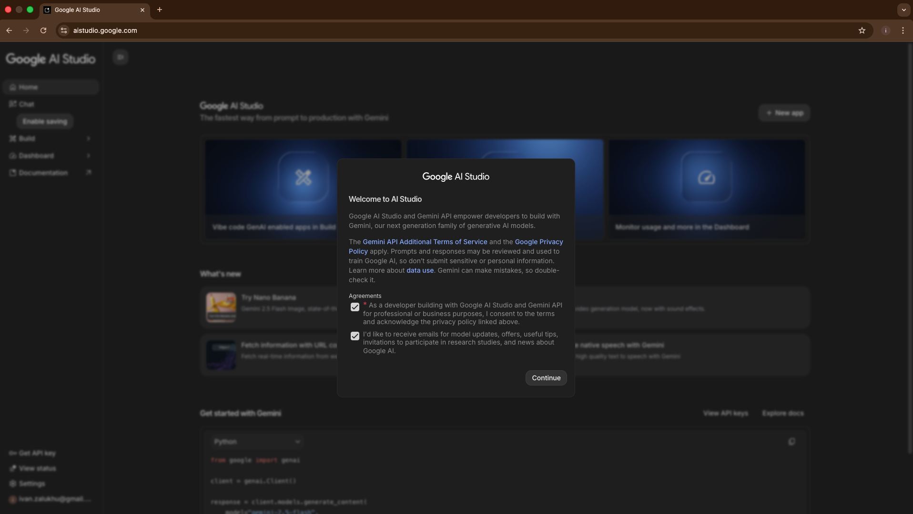
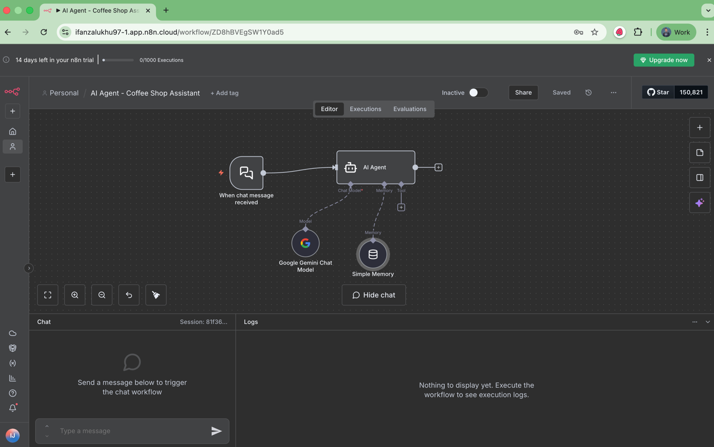

# Membuat AI Agent yang Lebih Interaktif dengan Gemini

Di exercise sebelumnya, AI Agent kita masih "kaku" karena hanya pakai If Node untuk menentukan respon.

Sekarang, kita akan buat AI Agent-nya jadi lebih interaktif dengan bantuan LLM Gemini dari Google.

⚠️ Sebelum masuk ke exercise ini, pastikan exercise sebelumnya sudah selesai, karena langkah-langkah di sini sifatnya berkelanjutan.
Kalau workflow kamu sebelumnya belum sesuai, nanti exercise berikutnya bisa bermasalah
Kalau belum sempat menyelesaikan, di repository ini sudah disiapkan [folder templates](../templates) — kamu bisa download dan import workflow template-nya langsung ke workspace n8n kamu.


## Setup Credential Gemini

Sebelum bisa pakai model Gemini di n8n, kita perlu API Key dulu.

1. Buka [Google AI Studio](https://aistudio.google.com/)
2. Centang bagian Agreement untuk menyetujui terms-nya 
3. Klik menu **Get API Key** 
4. Secara default akan muncul satu key. Klik key tersebut, lalu copy API Key yang muncul di popup 
5. Buka n8n
6. Masuk ke tab **Credentials** 
7. Klik tombol **Add First Credential**
8. Di kotak pencarian, ketik **Gemini**
9. Pilih **Google Gemini (PaLM) API** 
10. Isi kolom **API Key** dengan key yang tadi kamu dapat dari Google AI Studio 
11. Klik tombol **Save** di pojok kanan atas
12. Pastikan muncul pesan "Connection tested successfully" 

Kalau sudah muncul pesan itu, berarti koneksi ke API Gemini berhasil dan siap digunakan.

Sekarang tutup popup credential-nya.


## Update Workflow: AI Agent – Coffee Shop Assistant

Sekarang kita lanjut ke workflow yang sebelumnya sudah kamu buat.

1. Masuk ke tab **Workflows** di n8n
2. Klik workflow yang sudah kamu buat sebelumnya, misalnya "AI Agent – Coffee Shop Assistant"
3. Tambahkan node baru yaitu **AI Agent** 
4. Di bagian **Chat Model** dalam AI Agent, klik tombol **+** 
5. Karena kita mau pakai Gemini, cari dan pilih **Gemini / Google Gemini Chat Model**
6. Pastikan **Credential** yang dipilih adalah credential Gemini yang baru kamu buat tadi
7. Untuk **Model**, pilih **gemini-2.5-flash** (model ini cepat dan cocok untuk chatbot) 
8. Hapus node **If** dan **Edit Fields / Response** yang digunakan sebelumnya 
9. Hubungkan **Chat Trigger** node dengan **AI Agent** node 
10. Klik tombol **Open Chat**
11. Coba kirim pesan:
    ```
    Halo, nama saya Ifan
    ```
    atau kamu bisa ganti dengan nama kamu sendiri
12. AI Agent-nya akan membalas sesuai konteks yang diberikan


🎉 Sekarang AI Agent kamu sudah bisa berinteraksi langsung menggunakan LLM Gemini!

## Menambahkan Memory ke AI Agent

Tapi coba perhatikan — kalau kamu lanjut chat dengan:
```
"Siapa nama saya?"
```

AI Agent-nya bakal lupa 😅

Itu karena dia belum punya memory, jadi tidak menyimpan percakapan sebelumnya. Mari kita tambahkan memory-nya.

1. Di node **AI Agent**, klik tanda **+** di bagian **Memory**
2. Pilih **Simple Memory**
3. Ubah nilai **Context Window Length** jadi **10**
   
   Fungsi dari nilai ini adalah menentukan berapa banyak chat sebelumnya yang akan diingat.
   
   Jangan terlalu besar (misalnya 1000), karena makin besar nilai ini makin banyak token yang dikirim → biaya juga naik

4. Di kolom **Session Key**, isi dengan session ID.
   
   Kalau nanti diintegrasikan ke WhatsApp atau Telegram, key ini bisa diisi dengan nomor HP user. 

5. Coba reset chat dan ulangi percakapan seperti sebelumnya.
6. Kirim "Halo, nama saya Ifan"
7. Lalu kirim "Siapa nama saya?" 

Sekarang AI Agent harusnya bisa menjawab dengan benar 🧠✨

## Menambahkan System Message

Di AI Agent, ada fitur **System Message**.

Ini berguna untuk memberi instruksi ke AI Agent tentang persona, cara menjawab, dan batasan perilaku.

Mari kita tambahkan System Message ke AI Agent.

1. Double-click node **AI Agent**
2. Di bagian **Options**, klik **Add Options**
3. Pilih **System Message**
4. Isi **System Message** dengan teks berikut:
   ```
   Kamu adalah AI Agent – Coffee Shop Assistant, asisten virtual ramah dan pintar untuk sebuah coffee shop. Tugas utamamu adalah membantu pengguna memahami dan menganalisis data penjualan kopi, memberikan insight dari data, serta menjawab pertanyaan seputar performa toko secara sederhana dan informatif.
   ```
5. Klik **Save** dan tutup node-nya
6. Coba kirim chat "Hi" untuk menguji

Harusnya sekarang AI Agent kamu lebih berkarakter dan menjawab dengan gaya yang lebih natural ☕
