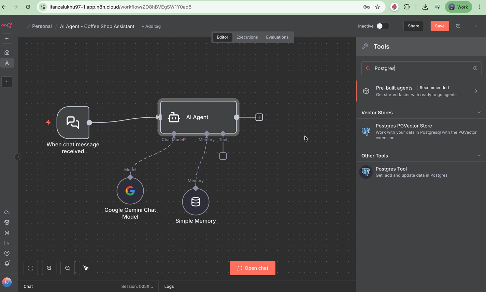

# Kenalan dengan AI Agent Tool

Sebelum masuk ke exercise ini pastikan **exercise sebelumnya sudah selesai**, karena materi di sini sifatnya **berkelanjutan**.  
Kalau exercise sebelumnya belum sesuai, maka latihan-latihan berikutnya bisa bermasalah.  
Kalau kamu belum menyelesaikannya, di repository ini ada folder [templates](../templates) — kamu bisa download dari situ lalu **import ke workspace n8n** kamu supaya tetap bisa lanjut.

---
## Sekilas Tentang AI Agent Tool di n8n

Di exercise ini kita mulai kenalan dengan **AI Agent Tool**.  
`n8n Tools AI Agent` node memungkinkan agent untuk mengakses dan menggunakan berbagai **tools eksternal** dan layanan seperti database, API, atau sistem lain. Node ini berfungsi mengintegrasikan **large language models (LLMs)** dengan tools tersebut, serta memilih tool mana yang paling cocok untuk tugas tertentu.

**Tools Agent** memungkinkan integrasi langsung antara AI dan sistem eksternal. Ia bisa memahami kemampuan tiap tool, lalu menentukan tool mana yang paling relevan tergantung konteks tugas.  
Dengan ini, AI Agent bisa bekerja layaknya asisten pintar yang bukan cuma “menjawab,” tapi juga **bertindak** berdasarkan data nyata.

---

## Menggunakan Postgres Tool

Dalam latihan ini kita akan menggunakan **Postgres Tool** agar AI Agent dapat melakukan query otomatis ke database **PostgreSQL**.

Untuk databasenya, kita akan menggunakan **[Supabase](https://supabase.com/)** sebagai hosting PostgreSQL.

---

## Setup Database di Supabase

1. Masuk ke halaman register Supabase: [https://supabase.com/dashboard/sign-up](https://supabase.com/dashboard/sign-up)
2. Isi email dan password → lalu cek email untuk konfirmasi. 
3. Buka email dan lakukan konfirmasi akun. 
4. Buat organisasi baru.
    - **Name**: isi dengan nama kamu
    - **Type**: pilih *Personal*
    - **Plan**: pilih *Free*
    - Lalu klik **Create Organization** 
5. Buat **project baru**:
    - Organization: pilih organisasi yang baru kamu buat
    - Project name: isi default saja
    - Database password: gunakan password yang aman dan **catat password ini**, karena nanti dipakai untuk koneksi database
    - Region: pilih yang terdekat, misalnya *Singapore*
    - Lalu klik **Create project** 
6. Di dashboard Supabase, buka menu **Database** 
7. Klik **Create New Table**
8. Isi dengan:
    - **Table name**:
       ```
        coffee_shop_sales
      ```
    - **Description**:
      ```
      Table ini menyimpan data transaksi penjualan kopi di coffee shop, termasuk informasi waktu penjualan, jenis pembayaran, nama produk kopi yang dijual, serta nilai transaksi. Data ini bisa digunakan untuk analisis penjualan berdasarkan jam, hari, bulan, atau kategori pembayaran.
      ```
9. Download dataset dari Kaggle: [Coffee Shop Dataset](https://www.kaggle.com/datasets/jawad3664/coffee-shop?select=coffe.csv)  
   Atau ambil file CSV dari folder [data](../data) di repository ini.
10. Kembali ke Supabase, klik **Import data from CSV** 
11. Upload file CSV tersebut, klik **Save** 
12. Klik **Save** sekali lagi untuk menyimpan tabelnya.

Setelah ini, database kamu sudah siap!


Sekarang kita lanjut untuk koneksi ke n8n.

---

## Connect Supabase PostgreSQL dengan n8n

1. Di n8n, buka **AI Agent**, lalu klik `+` di bagian **Tool**.
2. Cari dan pilih **Postgres Tool**  
   
3. Di bagian **Credential**, pilih `Create new credential`  
   
4. Dari Supabase, klik tombol **Connect**  
   
5. Ganti **method** ke `Transaction pooler`  
   
6. Expand bagian **View parameters**  
   
7. Copy parameter berikut dan isi di n8n:
    - Host
    - Database
    - User
    - Port  
      Sementara **Password** isi dengan password PostgreSQL yang kamu set sebelumnya.  
      

   > ⚠️ Kalau lupa password-nya, bisa reset di Supabase:  
   > Menu `Project Settings` → pilih `Database` → lalu klik `Reset database password`
8. Klik **Save**, pastikan muncul pesan **Connection tested successfully**  
   
9. Lalu klik **Close**.

---


## Buat AI Agent Tools

Disini nanti kita perlu 3 AI Agent Tools yaitu :

- `List Tables` ini nanti digunakan oleh AI Agent untuk mengecek / mengetahui di database kita ini ada table apa saja
- `Get Table Schema` ini nanti digunakan oleh AI Agent untuk mengecek / mengetahui di table kita ada column apa saja
- `Execute Select Query` ini nanti digunakan oleh AI untuk melakukan query untuk menjawab pertanyaan user

Jadi jika user bertanya `Saat ini product apa yg sering di beli berdasarkan nominal?`

Maka AI Agentnya menjalankan tools List Table untuk mengecek di database kita ada table apa saja --> baru dari table yg ada dia akan decide akan menggunakan table yg mana setelah itu dia akan jalankan Get Table Schema untuk mengecek column yg kita punya dari sana, baru dia susun query select dan query tsb lah yg dia jalankan di tool Execute Select Query.

### List Tables Tool
Jadi kita mulai terlebih dahulu buat tools List Table.
1. Kembali ke Postgres Tool tadi ubah nama nodenya menjadi
    ```
    List Tables
   ```
2. Tool description ubah dari Set automatically menjadi Set Manually.
3. Lalu isi description dengan ini

    ``` 
    Select list table from Postgres. Gunakan tool ini untuk mengecek / mengetahui di table database ada column apa saja.
   ```
4. Operation set ke `Execute Query`
5. Query nya isi dengan

    ```
   SELECT table_name FROM information_schema.tables WHERE table_schema = 'public'
    ```
   Kalau ingin lihat hasilnya bisa coba klik `Execute step`

### Get Table Schema Tool
1. Lalu kita perlu buat tool lainnya kita akan buat `Get Table Schema` bisa dengan click node List Table lalu ctrl + c untuk copy dan ctrl + v untuk paste.
2. Lalu hubungkan AI Agent tool ke node tool Get Table Schema. Setelah itu double click ke hasil copyan tsb
3. Ubah namanya menjadi

    ```
    Get Table Schema
    ```
4. Description isi
    ```
    Select table shema from Postgres. Gunakan tool ini untuk mengecek / mengetahui di table kita ada column apa saja
   ```
5. Query ganti menjadi
    ```
    SELECT column_name FROM information_schema.columns WHERE table_name = $1
   ```
   Disini ada $1 itu berarti di menerima parameters. Jika disini nanti akan diisi dengan table dari tools Get Tables. Nah yang tentukan table mana yg dipakai nanti ini yg menentukan adalah AI.
6. Untuk menghandle ini kita perlu tambah Query Parameters, caranya click `Add Option` lalu pilih `Query Parameters` 
7. Query parametersnya isi dengan ini

    ```
    {{ $fromAI('tableName', `The name of the table`, 'string') }}`.
   ```
   [$fromAI](https://docs.n8n.io/advanced-ai/examples/using-the-fromai-function/#use-the-fromai-function) adalah function yang berfungsi untuk secara dynamic / otomatis AI agent isi parameters yg diperlukan. Contohnya di case kita tadi kita perlu disini table name maka AI akan cari dan isi nilai tsb dengan table database


### Execute Select Query Tool
1. Terakhir kita tambah tool `Execute Select Query` copy paste tool Get Table Schema dan jangan lupa connect kan ke AI agent, lalu double click
2. Ubah namanya menjadi
    ```
    Execute Select Query
   ```
3. Isi description dengan
    ```
    Execute a SQL query in Postgres. Gunakan tool ini untuk melakukan query untuk menjawab pertanyaan user
   ```
4. Hapus `Query Parameters` nya
5. Ganti Query nya dengan
   ```
   {{ $fromAI('query', 'Generate the most appropriate SQL SELECT query based on the context and available data.') }}
   ```
   Setelah selesai save


### Update System Message AI Agent
Agar AI agent lebih jelas lagi, kita perlu tambahkan ini juga di system messagenya
```
Untuk menjalankan tugasmu, kamu memiliki 3 tools utama:
1. List Tables : Digunakan untuk memeriksa atau mengetahui tabel apa saja yang tersedia di dalam database.
2. Get Table Schema : Digunakan untuk melihat struktur tabel tertentu, termasuk daftar kolom yang ada di dalamnya.
3. Execute Select Query : Digunakan untuk menjalankan query dan mengambil data yang dibutuhkan agar kamu bisa menjawab pertanyaan pengguna dengan akurat.
```

### Uji AI Agent
1. Lalu coba kita jalankan chatnya dan tanya kedia
   ```
   Saat ini product apa yg sering di beli berdasarkan nominal?
   ```
2. Atau kita bisa tanya pertanyaan lain juga contohnya
   ```
   Berapa nominal penjualan per product?
   ``` 
   
