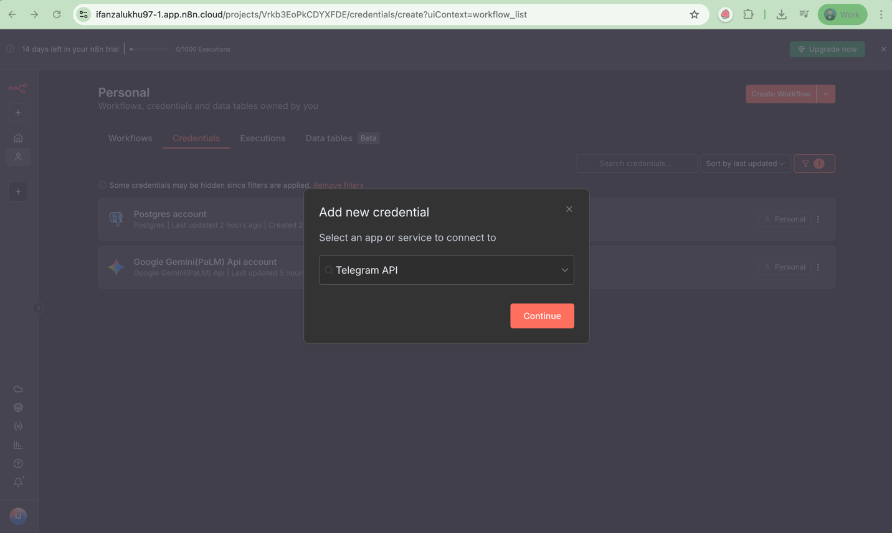
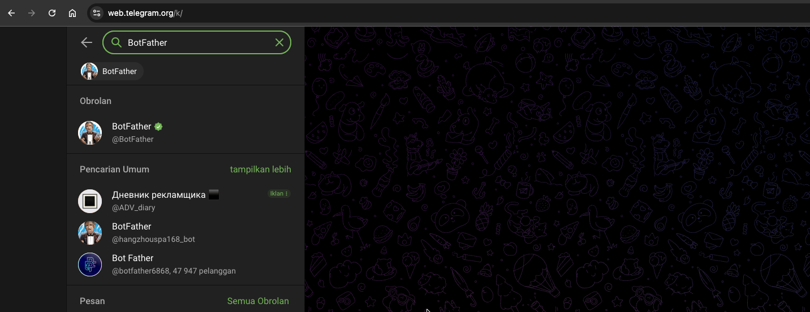

# Integrasi ke Telegram

Sebelum masuk ke exercise ini pastikan **exercise sebelumnya sudah selesai**, karena materi di sini sifatnya **berkelanjutan**.  
Kalau exercise sebelumnya belum sesuai, maka latihan-latihan berikutnya bisa bermasalah.  
Kalau kamu belum menyelesaikannya, di repository ini ada folder [templates](../templates) — kamu bisa download dari situ lalu **import ke workspace n8n** kamu supaya tetap bisa lanjut.

Disini kita akan mulai coba integrasi AI Agent kita dengan Telegram, jadi nanti bisa di akses dari Telegram.
Jadi trigger node yg Agent Chat saat ini kita akan replace dengan Telegram Node.

## Get Access Token Telegram Bot

Pertama-tama kita perlu integrasi kan n8n kita dengan telegram. Sehingga kita perlu buat credential telegram di n8n.

1. Di n8n masuk ke tab `Credential` dari menu Create Workflow click option buttonnya. Lalu pilih `Create Credential`
    
2. Cari `Telegram` lalu pilih `Telegram API` 
3. Dari popup yg muncul kita perlu `Access Token`. Dimana access token ini bisa didapatkan dari bot telegram. Jadi terlebih dahulu kita perlu buat Bot Telegram
4. Dari Telegram, cari `BotFather` pilih yg yg centang hijaunya 
5. Kalau Anda pertama kali akses `BotFather` biasanya ada pilihan start. Maka cukup click start saja
6. Untuk membuat new bot kirim pesan ke BotFather nya
    ```
   /newbot
    ```
   
7. Lalu nanti dia akan balas tanya nama bot nya. Isi dengan nama bot nya contohnya
    ```
   Ifan USU Workshop
   ```
   
8. Setelah itu dia akan tanya username bot nya. Untuk username bot harus di akhiri `_bot` atau `Bot`. Jadi kita buat
    ```
   ifan_usu_workshop_bot
   ```
   
    Access token ini nanti yg kita gunakan untuk akses bot telegram dari n8n. Access ini jangan dibagikan / share ke orang lain.
9. Copy access token tadi input di Access token n8n. Lalu klik save sampai muncul berhasil `Connection tested successfully ` .


## Ganti Trigger Ke Telegram
1. Buka / masuk ke n8n workspace kita sebelumnya yaitu `AI Agent - Coffee Shop Assistant`
2. Tambahkan node baru, cari `telegram`. Lalu pilih `Telegram` jangan pilih yg Telegram Tool 
3. Scroll ke bawah hingga ke `Triggers` pilih yang `On message` 
4. Kita coba test trigger dulu, click `Execute Step` dari telegram click bot yg kita buat tadi. Lalu click mulai / start. Dari sana nanti akan muncul payload dari pesan kita beserta text yg dikirim di `text`  
5. Kalau sudah muncul seperti di atas, berarti Telegram bot kita sudah jalan dan terhubung
6. Hapus trigger Chat Message ganti dengan node `Telegram Trigger` 
7. Kita perlu ganti session key di node `Simple Memory kita`. Double click. Session ID nya ganti menjadi `Define Below` 
8. Untuk Key nya drag id dari form ke `Key`. Sehingga dia akan terisi
    ```
   {{ $json.message.from.id }}
    ``` 
   
9. AI Agent Node juga kita perlu update. Double click ke nodenya. Ubah `Source for prompt (User Message)` menjadi `Define below` 
10. Drag `text` ke `Prompt (User Messagenya)`. Sehingga dia kurang lebih seperti ini : 
    ```
    {{ $json.message.text }}
    ```
    
11. Kalau coba kita jalankan, outputnya ada di output node `AI Agent`
12. Kita perlu add node baru agar setelah AI Agent proses n8n kirim balik jawabannya ke telegram kita. Disini kita perlu add node `Send a text message` dari Telegram.
13. Drag dan isi field yg diperlukan kurang lebih lebih seperti ini
    Chat ID
    ```
    {{ $('Telegram Trigger').item.json.message.chat.id }}
    ```

    Text
    ```
    {{ $json.output }}
    ```
    
14. Kalau kita click `Execute step` dia akan kirim pesan ke telegramnya
15. Save (ctrl + s) lalu close node telegram nya
16. Agar workflow nya live dan dia otomatis tanpa kita harus execute workflow setiap saat maka kita perlu aktifkan / publish workflownya. Caranya dengan click button `Activate Workflow` nya
    
17. Dari popup yg muncul pilih `Got it` 
18. `Production Checklist` skip dulu nanti kita jelaskan
19. Ok, sekarang workflownya setiap kita chat dari telegram akan di prosesnya dan dia jawab


### Uji AI Agent
1. Lalu coba kita jalankan chatnya dan tanya kedia
   ```
   Saat ini product apa yg sering di beli berdasarkan nominal?
   ```
2. Atau kita bisa tanya pertanyaan lain juga contohnya
   ```
   Berapa nominal penjualan per product?
   ``` 


### Catatan Lainnya
1. Saat ini di pesannya ada tambahkan pesan `This message was sent automatically with n8n` itu bisa dihilangkan dengan cara double click node `Send a text message`
2. Di bagian Addional Fields, click `Add Field`
3. Lalu pilih `Append n8n Attribute` lalu disable.  
4. Penjelasan mengenai Production Checklist
