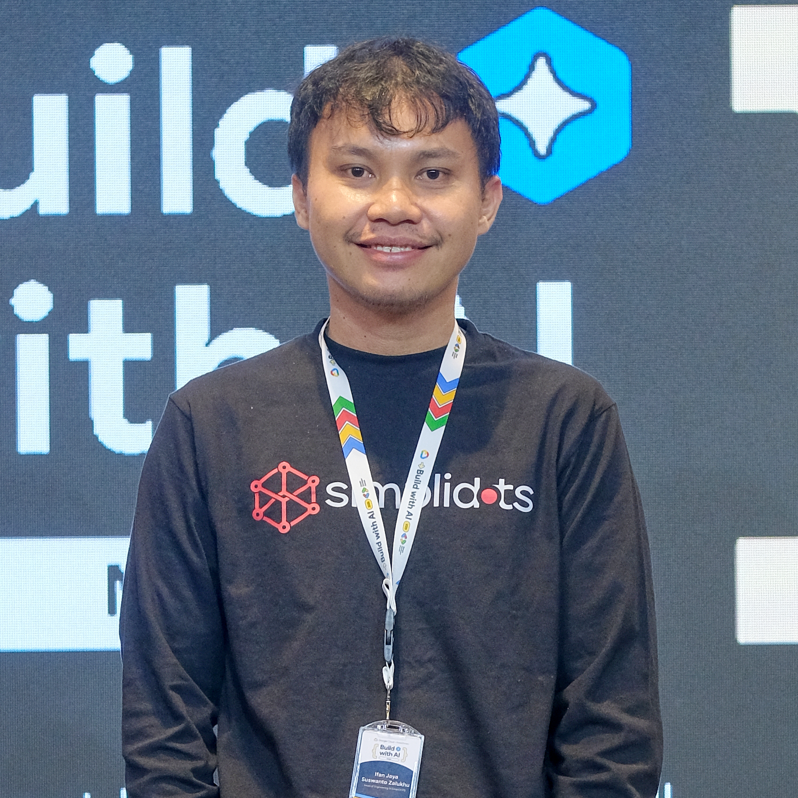
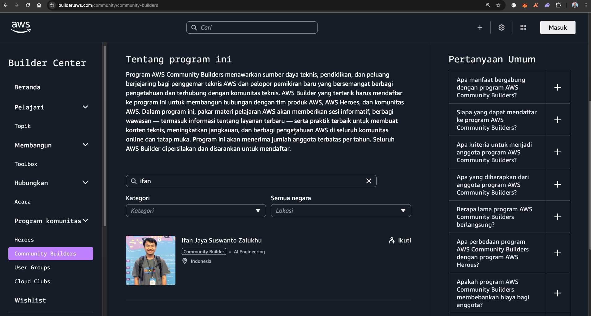
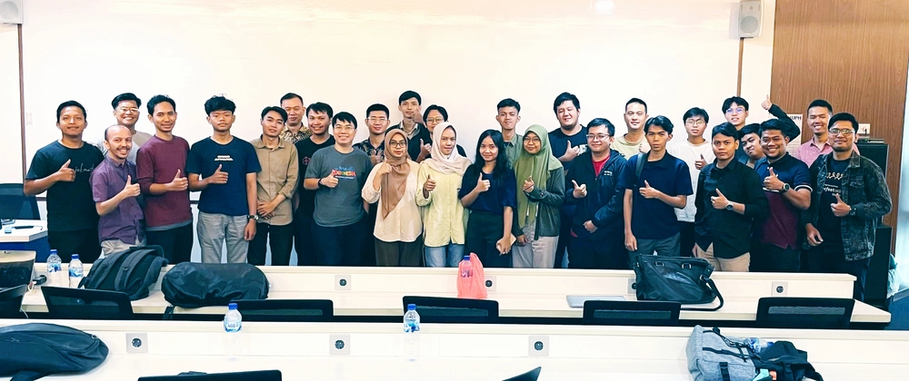
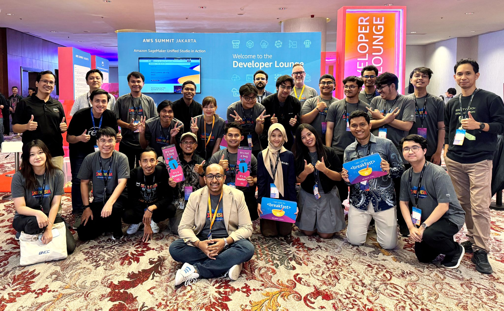
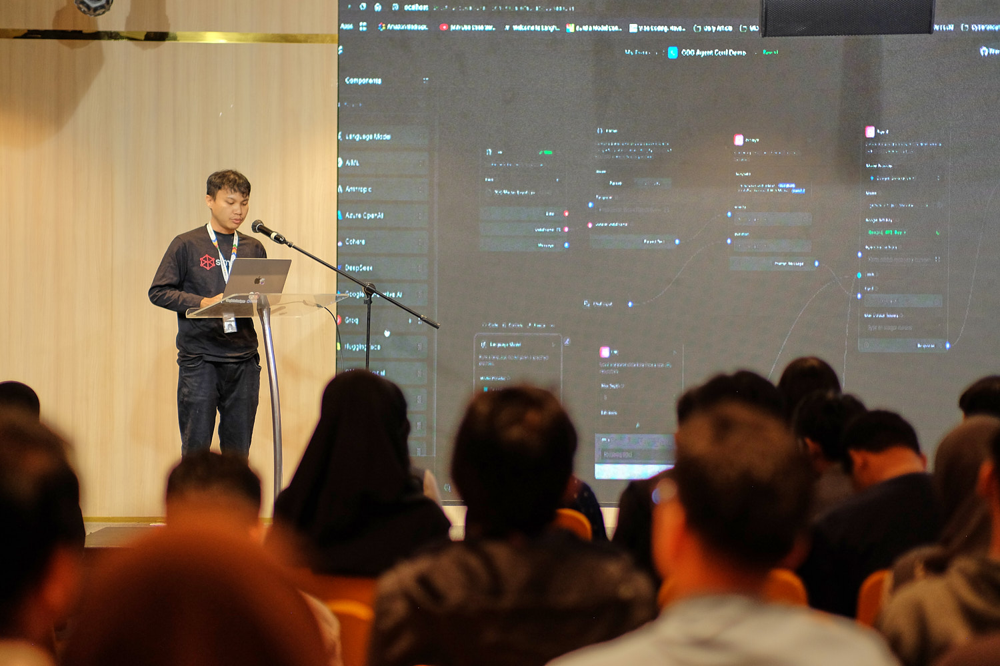
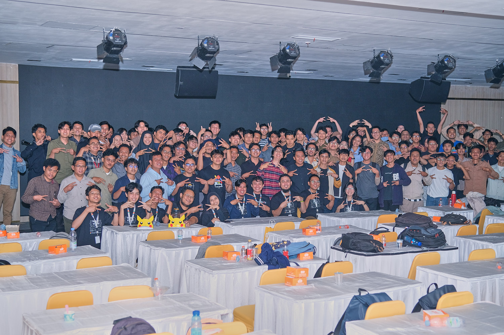
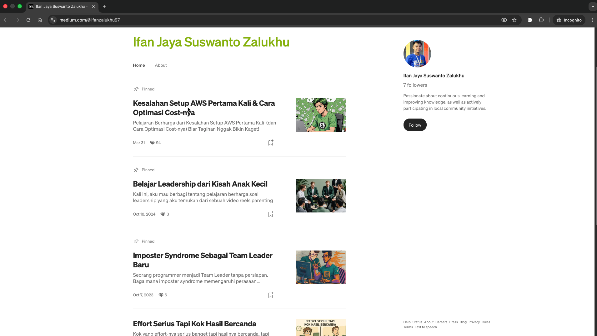
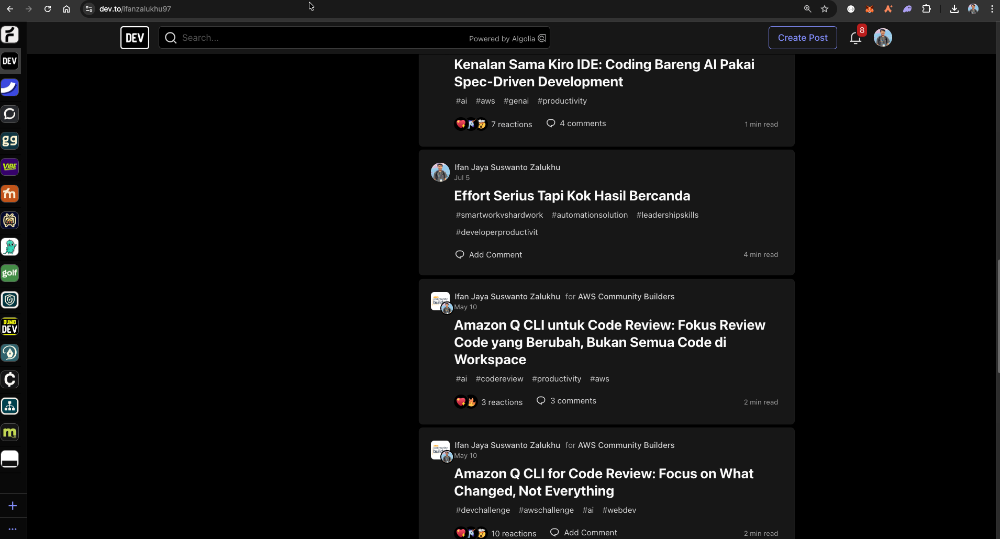

# 👋 Hi Everyone!

## Perkenalkan, saya **Ifan Jaya Suswanto Zalukhu**

💼 **Head of Engineering** di [**SimpliDOTS**](https://www.simplidots.com/)  
☁️ **AWS Community Builder** – *AI Engineering Category*  
💬 Aktif sharing di **tech community** seperti **AWS User Group Medan** & **Google Developer Group (GDG) Medan**

---

## 🚀 Tentang Saya

Saya suka **belajar hal baru seputar AI, automation, DevOps, dan engineering leadership** — dan paling semangat kalau bisa **sharing ke komunitas** biar makin banyak active belajar dan sharing di komunitas mengenai hal baru 💪

Beberapa kegiatan yang pernah saya isi / ikuti:

---

### 🟢 AWS Community Builders

Terpilih di kategori **AI Engineering**  

Aktif juga sharing di **AWS User Group Medan**  

---

### 🔵 Google Developer Group (GDG) Medan

Beberapa kali jadi speaker untuk topik **AI Journey**, **Automation dan AI Agent** 

---

### ✍️ Menulis di Medium & Dev.to

Kadang saya juga nulis artikel tentang **AI**, **engineering culture**, dan **tooling** di:
- [**Medium**](https://medium.com/@ifanzalukhu97)
- [**Dev.to**](https://dev.to/ifanzalukhu97)

---

## 🌐 Connect with Me
- 💼 [linkedin.com/in/ifanzalukhu97](https://linkedin.com/in/ifanzalukhu97)
- 💻 [github.com/ifanzalukhu97](https://github.com/ifanzalukhu97)
- ✍️ [medium.com/@ifanzalukhu97](https://medium.com/@ifanzalukhu97)
- 🧠 [dev.to/ifanzalukhu97](https://dev.to/ifanzalukhu97)

---
